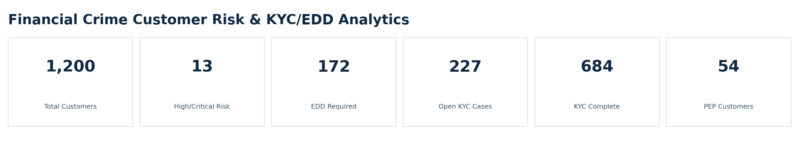
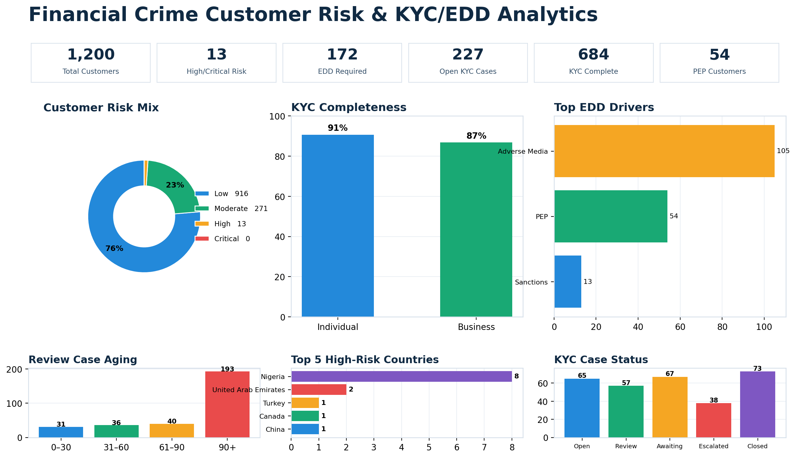
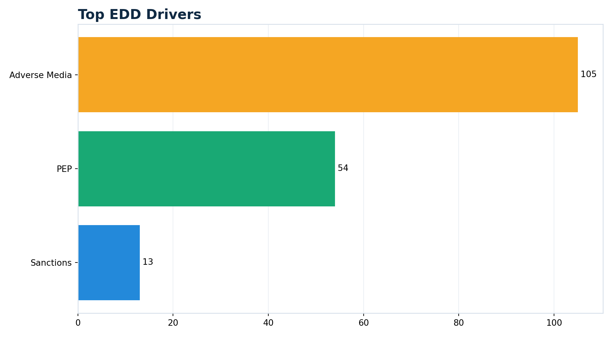

# Financial Crime Customer Risk & KYC/EDD Analytics

A synthetic end-to-end financial-crime analytics portfolio project focused on **customer risk, KYC completeness, enhanced due diligence, beneficial ownership, remediation, and review prioritization**.

## Stack
- SQL
- Python
- Tableau
- Streamlit

## Dataset
- 1,200 synthetic customers
- Individual and business customers
- KYC verification attributes
- PEP, sanctions, adverse-media indicators
- Beneficial ownership records
- KYC / EDD review cases
- Explainable customer risk scoring

## Dashboard
The executive dashboard follows the same polished design standard as the AML Transaction Monitoring project while using different and domain-valid KYC/EDD visualizations:

- Customer Risk Mix — donut
- KYC Completeness — customer-type bar chart
- Top EDD Drivers — horizontal bar chart
- Review Case Aging — aging buckets
- Top High-Risk Countries — top five
- KYC Case Status — workflow status


## Dashboard Preview

The visuals below come directly from the executive dashboard and summarize the project's customer-risk, KYC, and enhanced-due-diligence findings.

### KPI Scorecard



**What it represents:** The KPI scorecard provides an at-a-glance view of the overall KYC/EDD portfolio. It shows the size of the customer population, how many customers fall into High/Critical Risk, how many require Enhanced Due Diligence (EDD), the number of open KYC cases, completed KYC records, and PEP customers. These indicators show both customer-risk exposure and the due-diligence and remediation workload requiring attention.

### Executive Dashboard



**What it represents:** The executive dashboard combines the major customer-risk and KYC/EDD indicators into one management view. It connects customer risk segmentation with KYC completeness, EDD triggers, review-case aging, high-risk country exposure, and KYC case status. This makes it easier to identify where risk is concentrated, understand why customers are entering enhanced review, and prioritize cases that may require remediation, escalation, or additional due diligence.

### Customer Risk Mix


**What it represents:** The Customer Risk Mix shows how the 1,200-customer population is distributed across Low, Moderate, High, and Critical risk categories. Most customers fall within the lower-risk tiers, while a smaller population is classified as High risk. This helps an AML/KYC team quickly understand portfolio risk concentration and identify customers most likely to require enhanced monitoring, deeper review, or EDD.

### Top EDD Drivers



**What it represents:** The Top EDD Drivers visualization identifies the primary risk factors contributing to Enhanced Due Diligence reviews. In this portfolio, adverse media is the largest driver, followed by PEP exposure and sanctions indicators. The chart helps investigators understand why customers are being prioritized for enhanced review and which risk factors are creating the greatest EDD workload.


## Streamlit
Run:

```bash
cd app
pip install -r requirements.txt
streamlit run streamlit_app.py
```

## Resume bullets
**Financial Crime Customer Risk & KYC/EDD Analytics | SQL, Python, Tableau, Streamlit**

- Built an end-to-end KYC/EDD analytics project using synthetic customer, beneficial-ownership, and review-case data to identify high-risk customers, incomplete due-diligence records, PEP/sanctions/adverse-media exposure, and remediation priorities.
- Developed an explainable customer risk-scoring framework and SQL investigation logic, then created Tableau and Streamlit dashboards for customer-risk segmentation, EDD prioritization, KYC completeness, case aging, and escalation monitoring.

## Interview explanation
“I built a customer-risk and KYC/EDD analytics project that simulates how a bank or fintech can move from onboarding and verification data into risk tiering, enhanced due diligence, remediation, and review prioritization. SQL identifies high-risk populations and KYC gaps, Python builds an explainable risk score, Tableau provides executive monitoring, and Streamlit gives an analyst-style customer review workbench.”

## Disclaimer
Synthetic educational portfolio project only. No real financial institution or customer data.
